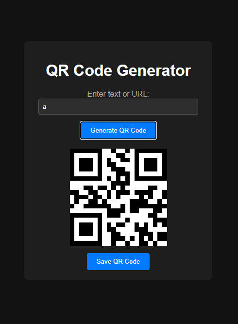

# QR Code Generator

A simple web-based QR code generator that allows users to input text or URLs and generate QR codes. Users can also save the generated QR code as an image file.

## Table of Contents

- [Introduction](#introduction)
- [Features](#features)
- [Getting Started](#getting-started)
- [How It Works](#how-it-works)
- [Technologies Used](#technologies-used)

## Introduction

This QR Code Generator is a straightforward web application that allows users to quickly generate QR codes from text or URLs. It provides an intuitive user interface and enables users to generate and save QR codes for their specific use cases. Is able to be carried in that one USB-stick most people carry since its a singular file and its a very small file.

## Features

- Generate QR codes from text or URLs.
- Save generated QR codes as PNG images.
- Simple and responsive user interface.
- Easy-to-use and minimalistic design.
- Able to be carried on a usb stick as a singular file

## Getting Started

To download said file, follow these steps:

1. Clone the repository: `git clone https://github.com/flyhtz/qr-code-generator.git`
2. Navigate to the project directory: `cd qr-code-generator`
3. Open `index.html` in a web browser.

## How It Works

1. Input text or URL in the provided text box.
2. Click the "Generate QR Code" button.
3. A QR code corresponding to the input will be displayed.
4. Click the "Save QR Code" button to download the generated QR code image.

## Technologies Used

- HTML5
- CSS3
- JavaScript
- QRCode.js library (https://github.com/davidshimjs/qrcodejs)